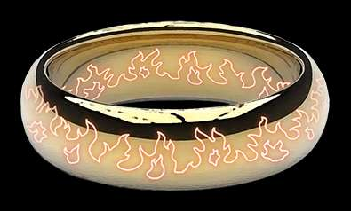

# Burning Ring of Fire


##  Buy a Hat
**Q1. Travel to the Burning Ring of Fire and purchase a hat from the vending machine with KringleCoin.**

1. Find the hat vending machine on the top level of Burning Ring of Fire
2. Choose a hat, it has instructions like:
```
To purchase this hat you must:
Use a KTM to pre-approve a 10 KC transaction to the wallet address: 0xF3781e37082752c1714354ac4d955b0dfE43144E
Return to this kiosk and use Hat ID: 23 to complete your purchase.
```
3. Go to the KTM which is at the right on the same level, choose "Approve KC Transfer".
4. Specify To Address (wallet address in instructions), Amount: 10, Your key: (given at the beginning of the game).
5. Return to machine, click on 'Approved Transaction?', enter your wallet address (also given at the beginning) and the Hat ID from the machine. 

##  Blockchain Divination

**Q1. Use the Blockchain Explorer in the Burning Ring of Fire to investigate the contracts and transactions on the chain. At what address is the KringleCoin smart contract deployed?**


Go to the bottom level of the Burning Ring of Fire, click on the terminal on the right. If you time it right, e.g. you just bought a hat, you can recognize the record because it has your wallet in the FROM address. If there are a lot of transactions, you may have to browse back but eventually you find it and see the fields:
```
From: <your wallet address>
To: 0xc27A2D3DE339Ce353c0eFBa32e948a88F1C86554
```

The TO-address (*0xc27A2D3DE339Ce353c0eFBa32e948a88F1C86554*) is that of the Kringle Coin smart contract.

##  Exploit a Smart Contract


**Q1.  Exploit flaws in a smart contract to buy yourself a Bored Sporc NFT. Find hints for this objective hidden throughout the tunnels.**
1. Download the code from Professor Petabyte, location was given in a hint as  https://github.com/QPetabyte/Merkle_Trees
2. If needed, install Docker and Linux subsys (for Windows machines) to run it.
3. Examine merkletrees.py - from its Readme, we should
	- Create a list of leaf values to include in the allowed list
		- We will want to include OUR wallet address here
	- Call the method to find the proof 
		- Location matters! The code assumes the proof is to be computed for the address at location 0, so our wallet address needs to be there (first address in 'allowlist').
4. Before that, we need to find at least one other address that was allowed. We can find that on the Bored Sporc Presale page, just pick any portrait's wallet and add that after the list. 
```python
allowlist = [
'<your wallet address>',
'<a presale Sporc's wallet, e.g. 0xa1861E96DeF10987E1793c8f77E811032069f8E9>']
```
5. Invoke the method on the Docker image 
```docker
docker build -t merkletrees .
docker run -it --rm --name=merkletrees merkletrees
```
6. That returns a value like:
```
Root: 0x7cf2e65d739011c16fd92cadee92ab63c22c2354d8b0a062f934fc9d7693f737
Proof: ['
0x3ca7b0f306be105d5e5b040af0e2bc35fb95026afcd89f726e8e94994c312f79
']
```
7. Take those values and go to the Presale page, enter your Wallet address and Proof to purchase.. uh-oh, it failed! But maybe that's not surprising since our Root value is in reality bogus. Inspecting their code, file bsrs.js, in Dev Tools, we see they have conveniently hardcoded their root which should contain only correct, pre-approved values but is trivially changed using a Javascript debugger to our bogus root. 
```javascript
function do_presale(){

		var address = document.getElementById("wa").value;
		var proof = document.getElementById('proof').value;
		var root = '0x52cfdfdcba8efebabd9ecc2c60e6f482ab30bdc6acf8f9bd0600de83701e15f1';
	...
	};

```
8. We resubmit our wallet and proof, pause the function in the debugger so we can swap in our root value for the hardcoded one, and receive this response.
```
Success! You are now the proud owner of BSRS Token #<Some Token>. You can find more information at https://boredsporcrowboatsociety.com/TOKENS/<Token>, or check it out in the gallery!
```

Your brand new Sporc NFT is waiting in the gallery at https://boredsporcrowboatsociety.com/TOKENS/TOKENIMAGES/BSRS\<Token\>.png. 


With proud Sporc in hand, we can now exit with the Burning Ring of Fire. 




Jump to: [KringleCon 2022 Orientation](KringleCon%202022%20Orientation.md) | [Tolkien Ring](Tolkien%20Ring.md) | [Elfen Ring](Elfen%20Ring.md) | [Web Ring](Web%20Ring.md)| [Cloud Ring](Cloud%20Ring.md)|Burning Ring of Fire| [KringleCon 2022 Wrap Up](KringleCon%202022%20Wrap-up.md)