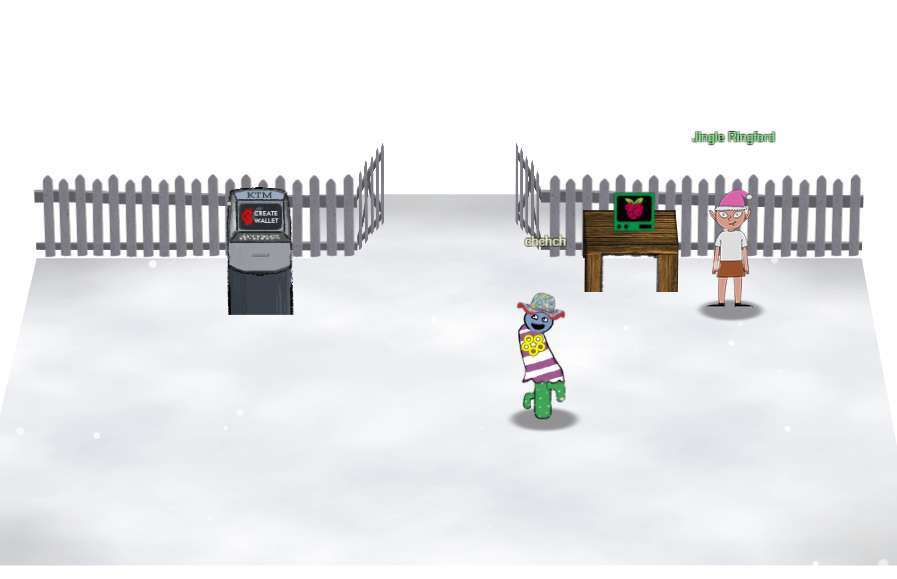
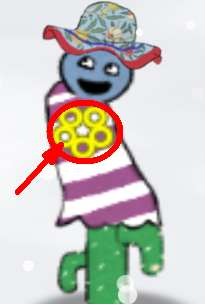

My first SANS Holiday Hack Challenge! 

## Orientation

### Talk to Jingle Ringford
You start off in a snowy wasteland, and Jingle is the only character in sight. Click on him, repeatedly if needed, to get all the info.  Jingle gives you a badge, and instructs you to interact with the KTM for your wallet, and Cranberry Pi (described below).

###  Get your badge
Your badge is the yellow flower-like icon on your character - it's actually five golden rings.

Clicking on it shows options you access throughout the game: 

Most of these options can also be accessed during gameplay through the bar at the left. From top to bottom: Story (book icon), Destionations (map pin), Objectives (checkbox), Hints (Info/I), Hats (Wizard hat), Achievements (ribbon).

Options:
- Story: Storyline unfolds as you play. Has a progress bar (though it occasionally glitches in calculating how much of the game is left)
- Destinations: Handy way to jump to a location if you have visited it before. Faster than watching your character lurch across the screen, a lifesaver when you explore a secret tunnel and can't find your way out. Some destinations initially show as '---' because they are inaccessible until you first solve a puzzle.

- Objectives: What you need to do. In some cases, this is where you enter your answer for a puzzle.
- Hints: You get several hints preloaded, but others come through talking with characters in the game or finding treasure chests. 
- Hats: You start with none, but don't worry, you will have a chance to satisfy your sartorial sense at the Hat Vending Machine in the Burning Ring of Fire. Don't go too crazy though - each hat costs 10 Kringle Coin, and you may need some KC for another venture!
- Talks: Links to the [KringleCon 2022 lectures](https://www.sans.org/mlp/holiday-hack-challenge/). Just good viewing overall, and some are of direct help in the game.
- Achievements: As you finish a puzzle/objective, these are displayed along with links to Tweet your achievement.
- Settings: Control the audio, chat icons, weather, and display. NOTE: the Chat List stores conversations with game characters. Sometimes an elf gives a hint, to access it you can go back and select the dropdown in the chat list to read it again. The chat list highlighted in the following picture:

And again in this picture where the player has moved to another part of the game, but wants to re-read what Jingle or Santa said by selecting from the chat list dropdown.

## Create a wallet

The KTM is the machine to the left. No input is required to create a wallet - it checks your account and generates a WALLET and KEY. Be sure to **WRITE THESE DOWN!**  You also receive a starting balance of 5 Kringle Coin.

## Use the terminal

The terminal is the green-framed box on the table. Click on it and it shows tmux with some instructions. Type 'answer' in the top pane as requested. 

After that, the gates will open and you can walk through to the next area. 

## Talk to Santa

Santa explains he's in a bind with the snowstorm, but worse, he's lost the five golden rings! Your mission is to find them. He loads your badge with the objectives, and with that, you are ready to enter the tunnel (small circular door to the right) and begin the game. Keep your eye out for treasure chests with hints and Kringle Coin - there are six throughout the game. 

For example, the following chest is seen between the Hall of Talks and Tolkien Ring. To get to it, try and walk toward the chest as you scale ladders, or walk. One of the squares is a secret tunnel to the chest - you won't be able to see your character while it is walking the tunnel. If you are stuck in a tunnel, click on Objectives in the left bar and teleport to another location. 

There is another chest in the Hall of Talks:

Jump to: KringleCon 2022 Orientation | [Tolkien Ring](Tolkien%20Ring.md) | [Elfen Ring](Elfen%20Ring.md) | [Web Ring](Web%20Ring.md)| [Cloud Ring](Cloud%20Ring.md)|[Burning Ring of Fire](Burning%20Ring%20of%20Fire.md)| [KringleCon 2022 Wrap-up](KringleCon%202022%20Wrap-up.md)
