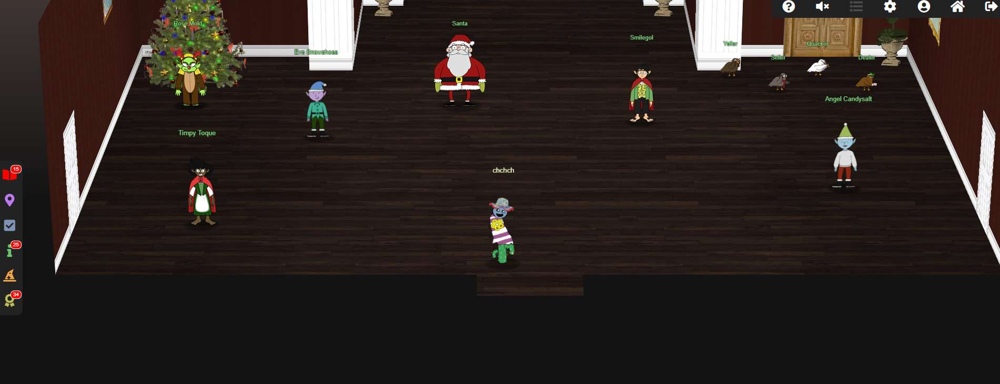

# Finale
And we are done! Off to Santa's castle for a party, and look who's there! It's Grinchum, looking much better as Smilegol. 



## Easter Eggs
### Glamtariel's Fountain
During conversation, you find out that Glamtariel has one green, two blues and one red ring. With XXE, you can send the blue ring or the red ring, and hear her chat about how much she likes those colors. However, if you send a green ring, you get the following
```
{
    "appResp": "Hey, who is this guy? He doesn't have a ticket!^I don't remember seeing him in the movies!",
    "droppedOn": "none",
    "visit": "static/images/x_phial_pholder_2022/tomb2022-tommyeasteregg3847516894.png,230px,30px"
}
```


## Exploit a Smart Contract
A typical Sporc NFT is worth about 100,000 KC, but someone noticed the following Sporc NFT was worth substantially more than the others:


I agree with the others, it's not a coincidence! 


## Credits
- Thank you to SANS for hosting this fun challenge! 
- Many thanks to the helpful people on [Discord](https://discord.gg/Wbmx92rWW3) who spent countless hours helping me and others. 

Go back to: [KringleCon 2022 Orientation](KringleCon%202022%20Orientation.md) | [Tolkien Ring](Tolkien%20Ring.md) | [Elfen Ring](Elfen%20Ring.md) | [Web Ring](Web%20Ring.md) | [Cloud Ring](Cloud%20Ring.md) | [Burning Ring of Fire](Burning%20Ring%20of%20Fire.md) | KringleCon 2022 Wrap Up|