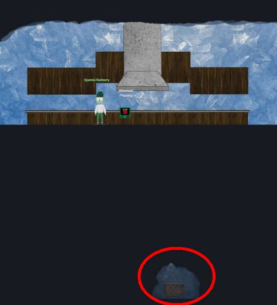

# Tolkien Ring
## Wireshark Practice


**Q1.  There are objects in the PCAP file that can be exported by Wireshark and/or Tshark. What type of objects can be exported from this PCAP?**

Open the pcap in Wireshark. File > Export Objects, see options:  *DICOM, HTTP, IMF, SMB, TFTP* 

**Q2. What is the file name of the largest file we can export?**

File > Export Objects > HTTP, see files listed. Largest is *app.php* with 808 kB - note that its units are KB, other files' units were in bytes.

**Q3. What packet number starts that app.php file?**

From earlier File > Export Objects window, the file starts in packet *687*. 

**Q4.  What is the IP of the Apache server?**

Apache is a web server, so we first filter by 'http'. Then, looking at the destination of the first GET request, it shows *192.185.57.242*.

**Q5.  What file is saved to the infected host?**

Looking through the packet for app.php on Wireshark, there was Javascript which created and saved a file *Ref_Sept24-2020.zip*.
```js 
    saveAs(blob1, 'Ref_Sept24-2020.zip');
```
**Q6. Attackers used bad TLS certificates in this traffic. Which countries were they registered to? Submit the names of the countries in alphabetical order separated by a commas (Ex: Norway, South Korea).**

Helpful article: https://richardatkin.com/post/2022/01/15/Identifying-and-retrieving-certificates-from-a-PCAP-file-using-Wireshark.html
- Find the handshake when the server responded in a TLS handshake
Apply Filter `tls.handshake.type == 2 and tls.handshake.certicates_length > 0`
-  Ensure out-of-order TCP packets are reassembled
Edit > Preferences > Protocol > TCP > TCP Reassembly enabled
- Look for largest certificates (the blog explains the certificate chaining tends to give the largest)
Looking in the middle window, expand 
Transport Layer Security > TLSv1.2 Record Layer: Handshake Protocol: Certificate
I manually looked through each entry and its certificates, found the following suspicious ones:
Packet 808: countryName = IL, state = Anourd Thiaveled..
Packet 3903: countryName = SS, state= Khartoum
- Look up the full country names 
From https://www.ssl.com/country-codes/, SS = South Sudan, IL = Israel
So the answer is *Israel, South Sudan*.

**Q7.  Is the host infected (Yes/No)?**

Erm, *yes*? Because that's what the elf asked us to look at the terminal. Possible other sign: Wireshark highlighted some packets in red because it was sending RST, ACK.

## Windows Logs


**Q1. What month/day/year did the attack take place? For example, 09/05/2021.**

I started with viewing the log in the bottom frame (`$ more powershell.evtx.log`). It returned the following, with the answer of *12/24/2022*.
```log
Verbose 12/24/2022 10:44:53 AM  Microsoft-Windows-PowerShell    4105    Starting Command        "Started invocation of ScriptBlock ID: 284c3131-3119-4d90-9420-a06130a8ca1b
```
**Q2. An attacker got a secret from a file. What was the original file's name?**
We want to find the files that were read. Powershell uses Get-Content for reading objects, including files: https://learn.microsoft.com/en-us/powershell/module/microsoft.powershell.management/get-content?view=powershell-7.3

For the rest of the puzzle, I found it easier to open the file in the bottom pane and search (`$ vi powershell.evtx.log` then use vi search commands from https://phoenixnap.com/kb/search-in-vim-vi). That yielded an answer of *Recipe*:
```
12/24/2022 3:05:23 AM   Microsoft-Windows-PowerShell    4103    Executing Pipeline      "CommandInvocation(Get-Content)  ""Get-Content"" ParameterBinding(Get-Content): name=""Path""; value="".\Recipe""`
```
**Q3. The contents of the previous file were retrieved, changed, and stored to a variable by the attacker. This was done multiple times. Submit the last full PowerShell line that performed only these actions.**

Using vi to looking through each Get-Content of Recipe, and noting any assignments to variables (marked by $), I saw:  
 
```
Line 10243:
Verbose 12/24/2022 3:01:20 AM   Microsoft-Windows-PowerShell    4104    Execute a Remote Command        Creating Scriptblock text (1 of 1):
\$foo = Get-Content .\Recipe| % {\$_ -replace 'honey', 'fish oil'} \$foo | Add-Content -Path 'recipe_updated.txt'
```
**Q4. After storing the altered file contents into the variable, the attacker used the variable to run a separate command that wrote the modified data to a file. This was done multiple times. Submit the last full PowerShell line that performed only this action.**

Windows logs has latest event at the top (you can cross-verify the timestamp of the log), so you want the instance of this pattern closest to the beginning of the file.

To write to a file, powershell uses "Add-Content" so we search for usages of the variable $foo and Add-Content. but search backwards for the latest invocation. 
```
Line 7462:  
$foo | Add-Content -Path 'Recipe'
```

**Q5. The attacker ran the previous command against one file multiple times. What is the name of this file?**
Again we search for $foo and note the filenames. This appears frequently, and the answer is *Recipe.txt*. 
```
line 7773:
Verbose 12/24/2022 3:04:44 AM   Microsoft-Windows-PowerShell    4104    Execute a Remote Command        "Creating Scriptblock text (1 of 1):^M
$foo | Add-Content -Path 'Recipe.txt'^M
```

**Q6. Were any files deleted? (Yes/No)**
Searching for Powershell's "Remove-Item", we find a few hits so *Yes*, files were deleted (specifically Recipe.txt and recipe_updated.txt)
```
Line 6733:
Information     12/24/2022 3:05:42 AM   Microsoft-Windows-PowerShell    4103    Executing Pipeline      "CommandInvocation(Remove-Item): ""Remove-Item""^M
ParameterBinding(Remove-Item): name=""Path""; value="".\Recipe.txt""^M

Line 6539:
Verbose 12/24/2022 3:05:51 AM   Microsoft-Windows-PowerShell    4106    Stopping Command        "Completed invocation of ScriptBlock ID: 5cc8d632-8b47-42d8-af27-8e1da0fdcdc2^M
Runspace ID: 4181eda9-20e6-4eb9-8869-fe5fa6d5e663"^M
Information     12/24/2022 3:05:51 AM   Microsoft-Windows-PowerShell    4103    Executing Pipeline      "CommandInvocation(Remove-Item): ""Remove-Item""^M
ParameterBinding(Remove-Item): name=""Path""; value="".\recipe_updated.txt""^M
```

**Q7. Was the original file (from question 2) deleted? (Yes/No)**
The original file was "Recipe", the Remove-Item was run on "Recipe.txt" and "recipe_updated.txt" so *No*.

**Q8. What is the Event ID of the logs that show the actual command lines the attacker typed and ran?** 
Since event logs have latest event first, we go to the end of the file (in vi: Esc-G) and scroll upward. This looks promising and the EventID is *4104*.
```
$Verbose 10/13/2022 4:13:43 PM   Microsoft-Windows-PowerShell    4104    Execute a Remote Command        "Creating Scriptblock text (1 of 1):^M
Get-ItemProperty HKLM:\Software\Wow6432Node\Microsoft\Windows\CurrentVersion\Uninstall\* | Select-Object DisplayName, DisplayVersion, Publisher, InstallDate | Format-Table –AutoSize^M
^M
```
**Q9**. Is the secret ingredient compromised (Yes/No)?
Given that the substitution updated the ingredients, *yes*.

**Q10**. What is the secret ingredient?
From the substitution command above, it is *honey*.

## Suricata Regatta


Tips before starting
- There are existing rules in the rules file you can study, as well as this document on Suricata [rule format](https://suricata.readthedocs.io/en/suricata-6.0.0/rules/intro.html).
- There is a numbering convention for Suricata rule signatures, per [Digital Ocean](https://www.digitalocean.com/community/tutorials/understanding-suricata-signatures) custom rules are usually numbered  **1000000-1999999**.

**Q1. First, please create a Suricata rule to catch DNS lookups for adv.epostoday.uk.**
``` Suricata
alert dns $HOME_NET any -> any any (msg:"Known bad DNS lookup, possible Dridex infection"; dns.query; content:"adv.epostoday.uk"; nocase; rev:1;sid:2025219;)`
```

**Q2. The infected IP address 192.185.57.242 communicates with internal systems over HTTP. When there's a match, the message (msg) should read Investigate suspicious connections, possible Dridex infection.**

This one took some time - I was filtering packets when receiving from the infected IP (454 packets caught), but the question mentions any communication so the answer should mirror the first rule to catch traffic both ways.
``` Suricata
alert http [192.185.57.242] any -> $HOME_NET any (msg:"Investigate suspicious connections, possible Dridex infection";rev:1;sid:2032974;) 
alert http $HOME_NET any -> [192.185.57.242] any (msg:"Investigate suspicious connections, possible Dridex infection";rev:1;sid:2032975;)
```
**Q3. We heard that some naughty actors are using TLS certificates with a specific CN.
Develop a Suricata rule to match and alert on an SSL certificate for heardbellith.Icanwepeh.nagoya.**
```Suricata
alert ip any any -> any any (tls.cert_subject;content:"CN=heardbellith.Icanwepeh.nagoya"; msg:"Investigate bad certificates, possible Dridex infection";rev:1;sid:2200074;)
```

**Q4. Let's watch for one line from the JavaScript: let byteCharacters = atob. Oh, and that string might be GZip compressed - I hope that's OK!**

These documents were useful : https://suricata.readthedocs.io/en/suricata-6.0.0/rules/payload-keywords.html  and https://suricata.readthedocs.io/en/suricata-6.0.0/rules/http-keywords.html#file-data.
```Suricata
alert http any any -> any any (content:"let byteCharacters = atob";msg:"Suspicious JavaScript function, possible Dridex infection";rev:1;sid:2032976;)
alert http any any -> any any (file_data;content:"let byteCharacters = atob";msg:"Suspicious JavaScript function, possible Dridex infection";rev:1;sid:2032977;)
```


With the above, we get our first golden ring - the Tolkien Ring. Nice LAN!


## Treasure Alert! 
Before you leave this hall, be sure to look for the hidden treasure chest by zooming out (Ctrl-) in the browser. There is a chest with a VERY helpful hint for the Burning Ring of Fire. You get there by trying to arrow down at various spots in the ground until you find the tunnel entrance.




Also, look for another chest near the entrance to the Elfen Ring as you move to the next Ring.


Jump to: [KringleCon 2022 Orientation](KringleCon%202022%20Orientation.md) | Tolkien Ring | [Elfen Ring](Elfen%20Ring.md) | [Web Ring](Web%20Ring.md)| [Cloud Ring](Cloud%20Ring.md)|[Burning Ring of Fire](#Burning%20Ring%20of%20Fire.md)| [KringleCon 2022 Wrap Up](#%20KringleCon%202022%20Wrap-up.md)